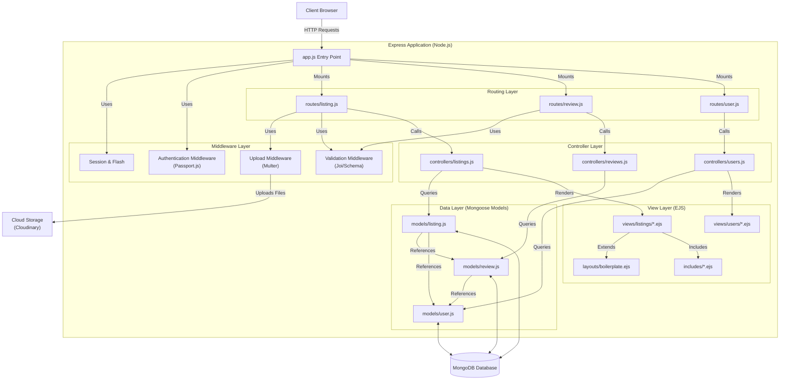

# Wanderlust

Wanderlust is a full-stack web application inspired by Airbnb, designed to help users discover and list unique places to stay. It allows users to create listings, upload photos, and write reviews.

## 🚀 Features

*   **Listings Management:** Users can create, read, update, and delete (CRUD) listings for accommodations.
*   **Review System:** Users can leave ratings and reviews for listings.
*   **User Authentication:** Secure signup and login functionality using Passport.js.
*   **Image Upload:** Integration with Cloudinary for storing listing images.
*   **MVC Architecture:** Follows the Model-View-Controller design pattern.
*   **Error Handling:** Robust error handling and validation using Joi.

## 🛠️ Tech Stack

*   **Frontend:** EJS (Embedded JavaScript templates), CSS, Bootstrap
*   **Backend:** Node.js, Express.js
*   **Database:** MongoDB, Mongoose
*   **Authentication:** Passport.js
*   **Cloud Storage:** Cloudinary
*   **Validation:** Joi

## 📂 Project Structure

```
major/
├── controllers/    # Logic for handling requests
├── init/           # Database initialization scripts
├── models/         # Mongoose schemas (Listing, Review, User)
├── public/         # Static assets (CSS, JS, Images)
├── routes/         # Express routes (listings, reviews, users)
├── utils/          # Utility functions (ExpressError, wrapAsync)
├── views/          # EJS templates
├── app.js          # Main application entry point
├── cloudConfig.js  # Cloudinary configuration
├── middleware.js   # Custom middleware
└── package.json    # Project dependencies
```

## ⚙️ Installation & Setup

1.  **Clone the repository:**
    ```bash
    git clone <repository-url>
    cd major
    ```

2.  **Install dependencies:**
    ```bash
    npm install
    ```

3.  **Configure Environment Variables:**
    Create a `.env` file in the root directory and add the following:
    ```env
    CLOUD_NAME=your_cloudinary_cloud_name
    CLOUD_API_KEY=your_cloudinary_api_key
    CLOUD_API_SECRET=your_cloudinary_api_secret
    ATLASDB_URL=your_mongodb_connection_string (or use local MONGO_URL)
    SECRET=your_session_secret
    ```

4.  **Initialize Database (Optional):**
    If you want to seed the database with sample data:
    ```bash
    node init/index.js
    ```

5.  **Run the Application:**
    ```bash
    node app.js
    ```

6.  **Access the App:**
    Open your browser and go to `http://localhost:8080`.

## 🏗️ Architecture



## 🤝 Contributing

Contributions are welcome! Please fork the repository and submit a pull request.

## 📄 License

This project is licensed under the ISC License.
