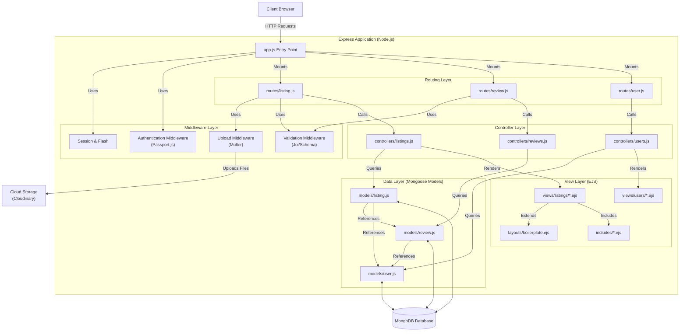

# Wanderlust

A full-stack Airbnb-inspired web application where users can discover, list, and review unique places to stay. Built with Node.js, Express, MongoDB, and EJS.

## Features

- **Listings CRUD** — Create, read, update, and delete accommodation listings
- **Image Uploads** — Cloudinary integration with client-side image preview
- **Reviews & Ratings** — Star ratings and text reviews per listing
- **Authentication** — Signup / login with Passport.js, password strength validation
- **Search & Filter** — Full-text search by title/location/country, category filters, pagination
- **Security** — Helmet headers, rate limiting, HTML sanitization, httpOnly cookies
- **Responsive UI** — CSS design system with custom properties, mobile-first layout

## Tech Stack

| Layer | Technology |
|---|---|
| Runtime | Node.js, Express 5 |
| Database | MongoDB, Mongoose |
| Templates | EJS, ejs-mate |
| Auth | Passport.js (local strategy) |
| Storage | Cloudinary + Multer |
| Security | Helmet, express-rate-limit, sanitize-html |
| Sessions | connect-mongo (MongoDB-backed) |
| Frontend | Bootstrap 5, Font Awesome, Plus Jakarta Sans |

## Project Structure

```
├── controllers/       # Route handlers (listings, reviews, users)
├── init/              # DB seed script and sample data
├── models/            # Mongoose schemas (Listing, Review, User)
├── public/            # Static assets (CSS, JS)
├── routes/            # Express routers
├── utils/             # ExpressError, wrapAsync helpers
├── views/             # EJS templates, layouts, partials
├── app.js             # Application entry point
├── cloudConfig.js     # Cloudinary setup
├── middleware.js       # Auth & ownership middleware
└── schema.js          # Joi validation schemas
```

## Quick Start

```bash
# 1. Clone
git clone https://github.com/Abhishek00codez/wanderlust-website.git
cd wanderlust-website

# 2. Install
npm install

# 3. Configure
cp .env.example .env      # then fill in your credentials

# 4. Seed (optional)
node init/index.js

# 5. Run
npm start                  # http://localhost:8080
```

### Environment Variables

| Variable | Required | Description |
|---|---|---|
| `CLOUD_NAME` | Yes | Cloudinary cloud name |
| `CLOUD_API_KEY` | Yes | Cloudinary API key |
| `CLOUD_API_SECRET` | Yes | Cloudinary API secret |
| `MONGO_URL` | No | MongoDB connection string (defaults to localhost) |
| `SESSION_SECRET` | No | Session encryption secret (defaults to fallback) |
| `PORT` | No | Server port (defaults to 8080) |

## Deployment (Render)

1. Push to GitHub.
2. Create a **Web Service** on [Render](https://render.com).
3. Set **Build Command**: `npm install`
4. Set **Start Command**: `npm start`
5. Add all environment variables from the table above.
6. Set `MONGO_URL` to your **MongoDB Atlas** connection string.

## Architecture


```mermaid
graph TD
    %% Nodes
    Client["Client Browser"]
    
    subgraph "Express Application (Node.js)"
        App["app.js Entry Point"]
        
        subgraph "Middleware Layer"
            AuthMW["Authentication Middleware<br/>(Passport.js)"]
            UploadMW["Upload Middleware<br/>(Multer)"]
            ValidationMW["Validation Middleware<br/>(Joi/Schema)"]
            SessionMW["Session & Flash"]
        end
        
        subgraph "Routing Layer"
            ListingsRouter["routes/listing.js"]
            ReviewsRouter["routes/review.js"]
            UsersRouter["routes/user.js"]
        end
        
        subgraph "Controller Layer"
            ListingsController["controllers/listings.js"]
            ReviewsController["controllers/reviews.js"]
            UsersController["controllers/users.js"]
        end
        
        subgraph "Data Layer (Mongoose Models)"
            ListingModel["models/listing.js"]
            ReviewModel["models/review.js"]
            UserModel["models/user.js"]
        end
        
        subgraph "View Layer (EJS)"
            Layouts["layouts/boilerplate.ejs"]
            ListingViews["views/listings/*.ejs"]
            UserViews["views/users/*.ejs"]
            Partials["includes/*.ejs"]
        end
    end

    DB[("MongoDB Database")]
    CloudStorage["Cloud Storage<br/>(Cloudinary)"]

    %% Relationships
    Client -- "HTTP Requests" --> App
    
    App -- "Uses" --> SessionMW
    App -- "Uses" --> AuthMW
    App -- "Mounts" --> ListingsRouter
    App -- "Mounts" --> ReviewsRouter
    App -- "Mounts" --> UsersRouter

    ListingsRouter -- "Uses" --> UploadMW
    ListingsRouter -- "Uses" --> ValidationMW
    ListingsRouter -- "Calls" --> ListingsController

    ReviewsRouter -- "Uses" --> ValidationMW
    ReviewsRouter -- "Calls" --> ReviewsController

    UsersRouter -- "Calls" --> UsersController

    ListingsController -- "Queries" --> ListingModel
    ReviewsController -- "Queries" --> ReviewModel
    UsersController -- "Queries" --> UserModel

    ListingModel -- "References" --> ReviewModel
    ListingModel -- "References" --> UserModel
    ReviewModel -- "References" --> UserModel

    ListingsController -- "Renders" --> ListingViews
    UsersController -- "Renders" --> UserViews
    
    ListingViews -- "Extends" --> Layouts
    ListingViews -- "Includes" --> Partials

    ListingModel <--> DB
    ReviewModel <--> DB
    UserModel <--> DB

    UploadMW -- "Uploads Files" --> CloudStorage
```

## 🤝 Contributing

Contributions are welcome! Please fork the repository and submit a pull request.

## 📄 License

This project is licensed under the ISC License.
